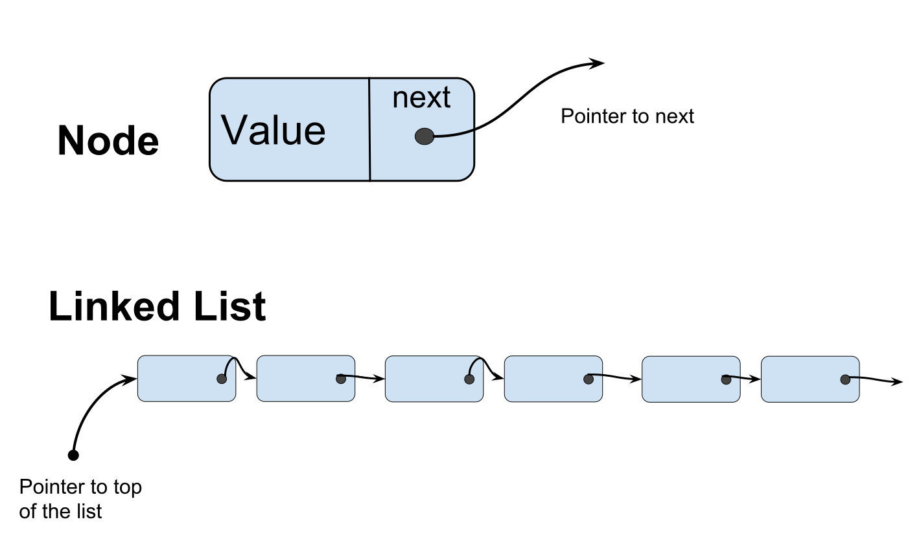

Linked List
===========

* Linear data structure (like an array)
* Linked list is used when there is a memory issue (capacity limit)
* Dynamically grows


</img>

## Class Node

```c++
class Node {
    private:
        int element;
        Node *next_node;
        
    public:
        Node(int = 0, Node * = nullptr);
        int retrieve() const;
        Node *next() const;
}

```

**Constructor:**
```c++
Node:Node(int e, Node * n) {
    element = e;
    next_node = n;
}
```
or
```c++
Node:Node(int e, Node * n):
    element (e),
    next_node (n) {
    // empty constructor
}

```

### Accessors

```c++
int Node::retrieve() const {
    return element;
}

int *Node::next() const {
    return next_node;
}
```

## Class List

```c++
class List {
    private:
        Node *
        
    public:
        
        // Accessros 
        bool empty() const;
        int get_front() const;
        Node *head() const;
        int size() const;
        int count(int) const;
        
        // mutators
        void push_front(int);
        int pop_front();
        void erase(int);
        
}
```

### Operations

* insert  
* 

#### empty()

```c++
bool List::empty() const {
   return(list_head == nullptr);
}
```

#### head()

```c++
Node *List::head() const {
    if (list_head == nullptr) {
        // throw exception;
    }
    return(list_head);
}
```

#### get_front()

```c++
int List::get_front() const {
    return head()->retrieve();
}
```

### push_front(int)

**Adding an element to the front**

* Create a new node
* Store the value in the new node
* From the new node, point to the front of the existing list

```c++
void List::push_front(int n) {
    if (empty()) {
        list_head = new Node(n, nullptr);
    }else{
        list_head = new Node(n, head());
    }
}
```

* Shorter version 
 
```c++
void List::push_front(int n) {
    list_head = new Node(n, head());
}
```

### pop_front()

**Pop the first element of the list and remove it**

```c++
int List::pop_front() {
    int e = front();
    Node *ptr = list_head;
    
    list_head = head()->next();
    delete(ptr);
    return(e);
}
```

### Stepping through a linked list

```c++
for (Node *ptr = head(); ptr != nullptr; ptr = ptr->next()) {
    // so something
}
```

### Counting instances

* We need to step through the linked list

```c++
int List::count(int n) const {
    int node_count = 0;
    
    for(Node *ptr=head(); ptr != nullptr; ptr=ptr->next()) {
        if(ptr->retrieve() == n){
            node_count++;
        }
    }
    return(node_count);
}
```

### Erasing matching elements

```c++
void List::erase(int n) {
    Node *prev_ptr, *ptr;
    for (Node *ptr=head(); ptr != nullptr; prev_ptr=ptr, ptr=ptr->next()) {
        if (ptr->retrieve() == n) {
            // ...
            
        }
        Node *prev_ptr = ptr;
    }
}
```

## Example


### Static allocation

```c++
int f() {
    List mylist;

    ls.push_front(3);
    cout << ls.front() << endl;

}
```

### Dynamic allocation

```C++
List *f() {
    List *pls;

    pls->

}
```


# Exceptions

```c++
class underflow {
    // empty
};

...

throw underflow();
```


```python

```
