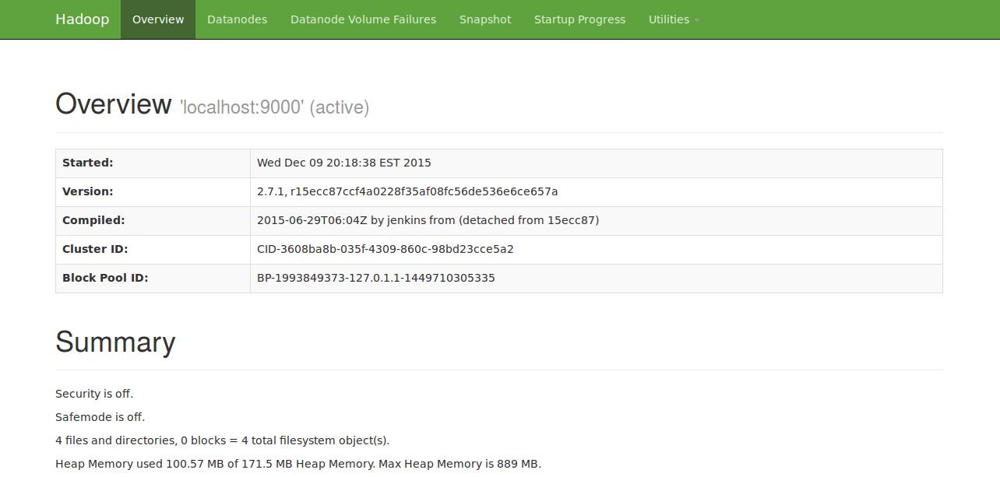
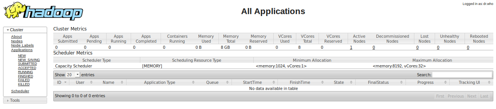

Installing Hadoop on Ubuntu
===========

1. Install **Java**

```
   vmirly@ubuntu:~$ sudo apt-get update

   vmirly@ubuntu:~$ sudo apt-get install default-jdk

   # Check Java version
   vmirly@ubuntu:~$ java -version
   java version "1.7.0_91"
   OpenJDK Runtime Environment (IcedTea 2.6.3) (7u91-2.6.3-0ubuntu0.15.04.1)
   OpenJDK 64-Bit Server VM (build 24.91-b01, mixed mode) 
```

2. Add a **user** and assign it to hadoop group

```
   vmirly@ubuntu:~$ sudo addgroup hadoop

   vmirly@ubuntu:~$ sudo adduser --ingroup hadoop hduser
```

3. Install **sshd**

```
   vmirly@ubuntu:~$ sudo apt-get install sshd

   # check installation to see if sshd is running
   vmirly@ubuntu:~$ which sshd
   /usr/sbin/sshd
```

4. Configure **ssh** for passwordless entry

```
   vmirly@ubuntu:~$ su hduser
   hduser@ubuntu:~$ ssh-keygen -t rsa 
   # save the file under /home/hduser/.ssh/hadoop
   # don't add any passphrase for convenience

   # Copy the public key to authorized_keys file
   cat /home/hduser/.ssh/hadoop.pub > /home/hduser/.ssh/authorized_keys

   hduser@ubuntu:~$ eval `ssh-agent`
   Agent pid 5654
   hduser@ubuntu:~$ ssh-add /home/hduser/.ssh/hadoop
   Identity added: /home/hduser/.ssh/hadoop (rsa w/o comment)
```

Check the ssh configuration:

```
   hduser@ubuntu:~$ ssh localhost
```

5. Download and Configure **Hadoop** environment

Find the lastest stable *hadoop common* from this link: http://www.apache.org/dyn/closer.cgi/hadoop/common/

and download it via *wget [enter the link to your mirror here]*

```
   # Extract the doanlowded file
   hduser@ubuntu:~$ tar xvfz hadoop-2.7.1.tar.gz
```

After extracting, go to the distribution directory, and edit *etc/hadoop/hadoop-env.sh*

and change the line for JAVA_HOME to include the parent directory that contains Java, as follows

```
# The java implementation to use.
export JAVA_HOME=/usr
```

You can find out your java installation by 
```
   hduser@hadoop:~$ which java
   /usr/bin/java
```


Try runnning hadoop tp get the help
```
   hduser@ubuntu:~/hadoop-2.7.1$ bin/hadoop
   Usage: hadoop [--config confdir] [COMMAND | CLASSNAME]
     CLASSNAME            run the class named CLASSNAME
    or
     where COMMAND is one of:
     fs                   run a generic filesystem user client
     version              print the version
     jar <jar>            run a jar file
                       note: please use "yarn jar" to launch
                             YARN applications, not this command.
     checknative [-a|-h]  check native hadoop and compression libraries availability
     distcp <srcurl> <desturl> copy file or directories recursively
     archive -archiveName NAME -p <parent path> <src>* <dest> create a hadoop archive
     classpath            prints the class path needed to get the
     credential           interact with credential providers
                       Hadoop jar and the required libraries
     daemonlog            get/set the log level for each daemon
     trace                view and modify Hadoop tracing settings

  Most commands print help when invoked w/o parameters.
```

If your configuration is correct, then by trying command *version* you should get
```
   hduser@ubuntu:~/hadoop-2.7.1$ bin/hadoop version
   Hadoop 2.7.1
   Subversion https://git-wip-us.apache.org/repos/asf/hadoop.git -r 15ecc87ccf4a0228f35af08fc56de536e6ce657a
   Compiled by jenkins on 2015-06-29T06:04Z
   Compiled with protoc 2.5.0
   From source with checksum fc0a1a23fc1868e4d5ee7fa2b28a58a
   This command was run using /home/hduser/hadoop-2.7.1/share/hadoop/common/hadoop-common-2.7.1.jar
```

6. Setup Hadoop in **Pseudo-Distributed** mode

Edit *etc/hadoop/core-site.xml* as follows

```
<configuration>
    <property>
        <name>fs.defaultFS</name>
        <value>hdfs://localhost:9000</value>
    </property>
</configuration>
```

and specify the number of replication for HDFS in *etc/hadoop/hdfs-site.xml* file 

```
<configuration>
    <property>
        <name>dfs.replication</name>
        <value>1</value>
    </property>
</configuration>
```

7. Start Using HDFS

You can use HDFS as follows

```
   hduser@ubuntu:~/hadoop-2.7.1$ bin/hdfs namenode -format
   
```

Start namenode and datanode daemons:

```
   hduser@ubuntu:~/hadoop-2.7.1$ sbin/start-hdfs.sh 
```

Now, you should be able to run HDFS commands such as -ls, -mkdir, -put ...

Also, the web-interface can be accessed at http://localhost:50070



After you are done, stop the daemons:

```
   hduser@ubuntu:~/hadoop-2.7.1$ sbin/stop-hdfs.sh
```

8. Configure and use **YARN**

In order to run map-reduce jobs on YARN, we need to configure etc/hadoop/mapred-site.xml

If this file doesn;t exist, copy it from the template 

```
    hduser@ubuntu:~/hadoop-2.7.1$ cp etc/hadoop/mapred-site.xml.template etc/hadoop/mapred-site.xml
```

Then, add the following to it

```
<configuration>
    <property>
        <name>mapreduce.framework.name</name>
        <value>yarn</value>
    </property>
</configuration>
```

as well as etc/hadoop/yarn-site.xml

```
<configuration>
    <property>
        <name>yarn.nodemanager.aux-services</name>
        <value>mapreduce_shuffle</value>
    </property>
</configuration>
```

Then, we can start YARN resource manager by

```
    hduser@ubuntu:~/hadoop-2.7.1$ sbin/start-yarn.sh
```

And the resource manager web interface can be seen at http://localhost:8088/


